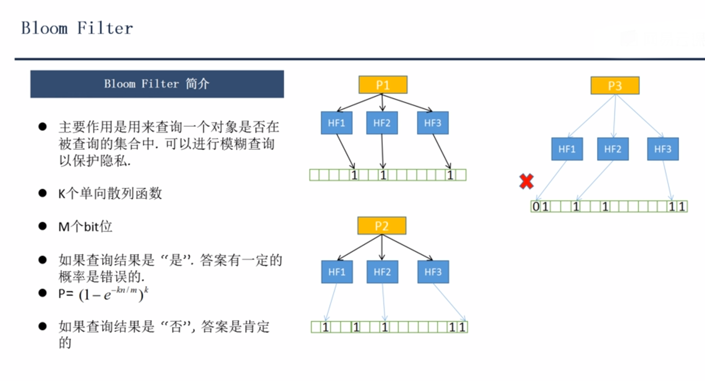
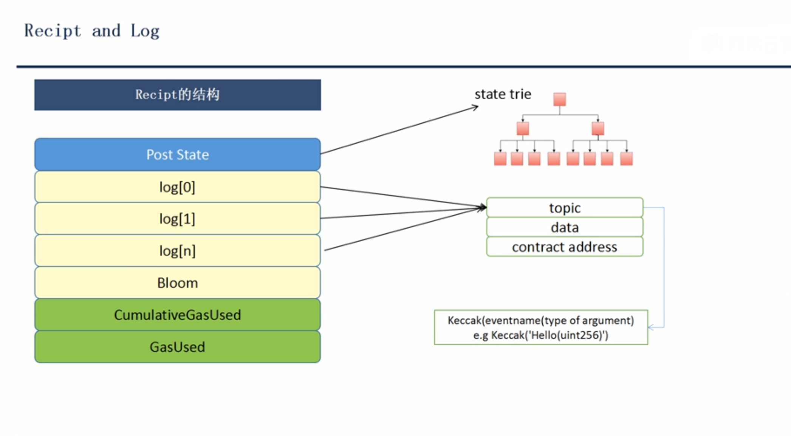
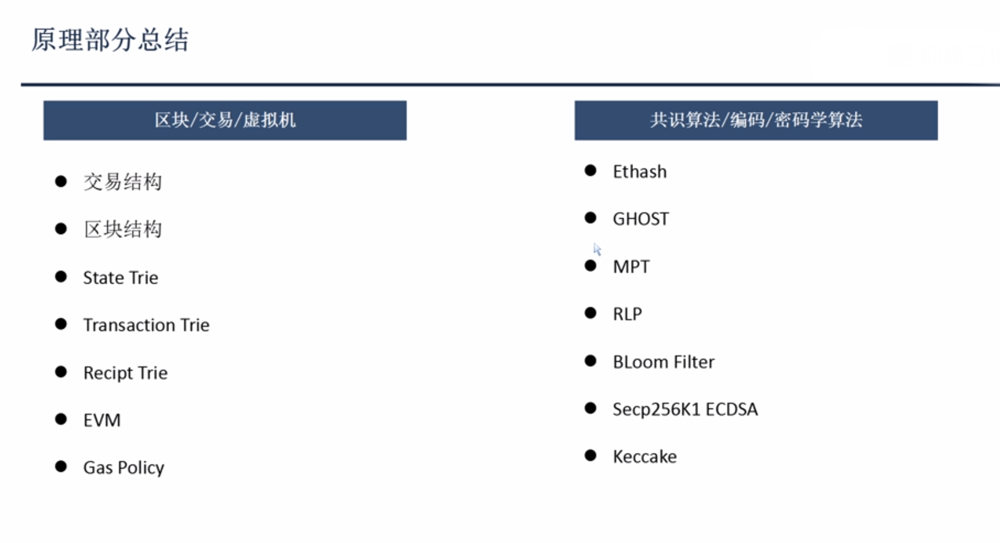

#### Bloom过滤器和收据

Bloom Filter是一种空间效率很高的随机数据结构，它的原理是，当一个元素被加入集合时，通过K个Hash函数将这个元素映射成一个位阵列（Bit array）中的K个点，把它们置为1。检索时，我们只要看看这些点是不是都是1就（大约）知道集合中有没有它了：如果这些点有任何一个0，则被检索元素一定不在；如果都是1，则被检索元素很可能在。这就是布隆过滤器的基本思想

1、 Post State 代表处理后的状态，当一个交易执行完成后，在以太坊的实现中
用了一个state object 的对象代表所有在全局状态树中的帐户结点，是所有的state object加总的
rlp处理过的输出值的kaccak单向散列值
2、 log 分为两部分（记录EVM每一步执行日志和EVENT 日志）
> event 日志包含 topic data(和合约ABI有关) contract_address

3、 Bloom 供外界查询某一个topic的日志是否在已有的日志集合中
4、 执行到当前收据为止总共使用的gas，不能超过区块的gas
5、当前交易所用的gas

