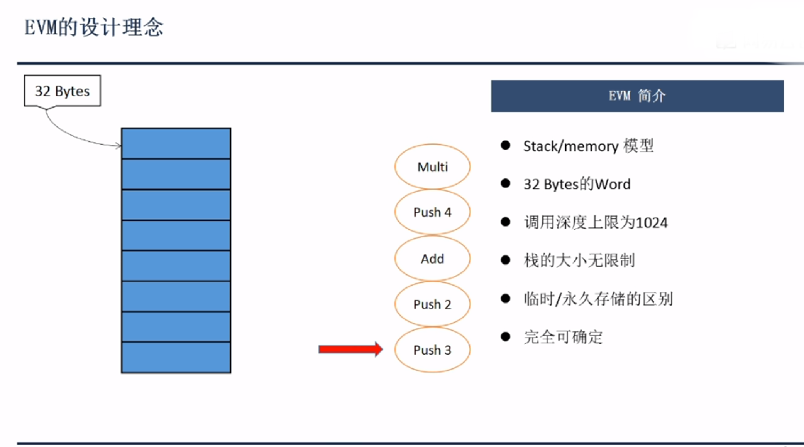
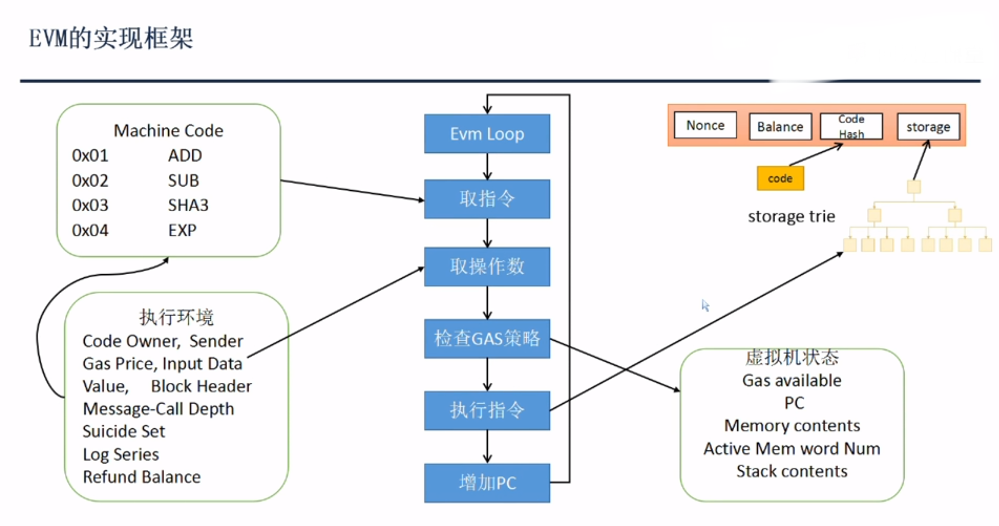
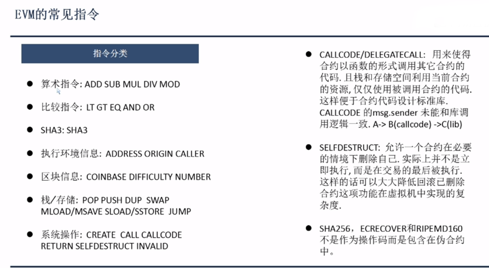
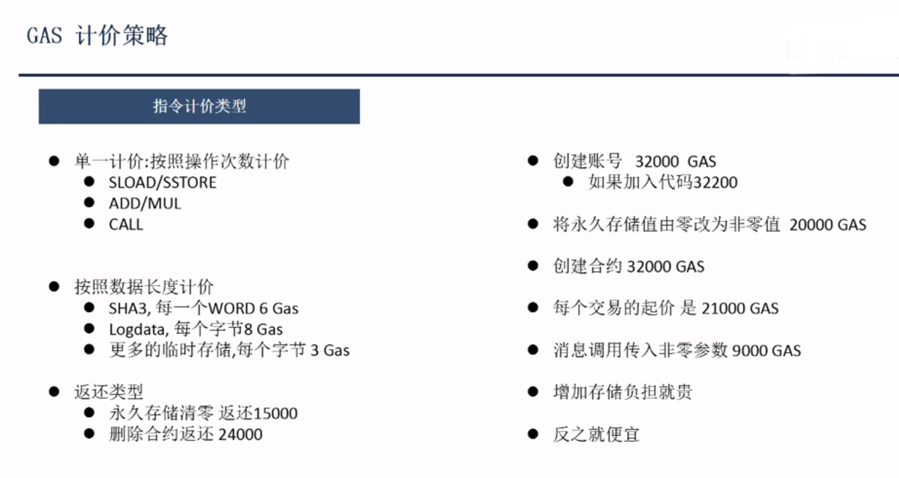
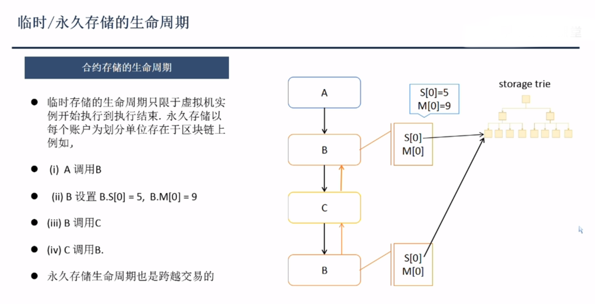

### EVM设计理念
[][zhihu]

1、 基于栈的虚拟机，栈的每个元素为32字节，适应相关加密算法如kaccak
2、 合约间的调用上限为1024
3、 栈的大小无限制，依靠gasLimit及调用深度来限制
4、 区分临时和永远存储
5、 每一步有一个完全可以确定的结果，及可以回滚

虚拟机的执行为一个无限循环,步骤:
1、 取指令，指令存在于EVM中执行环境数据结构（包含合约指令）中
2、 取操作数
4、 检查GAS策略
5、 执行指定
6、 增加PC
7、 继续第一步

值得注意的是永久存储的值是存在全局状态MPT中，有合约实例修改永久存储的值都会去修改里面的值
