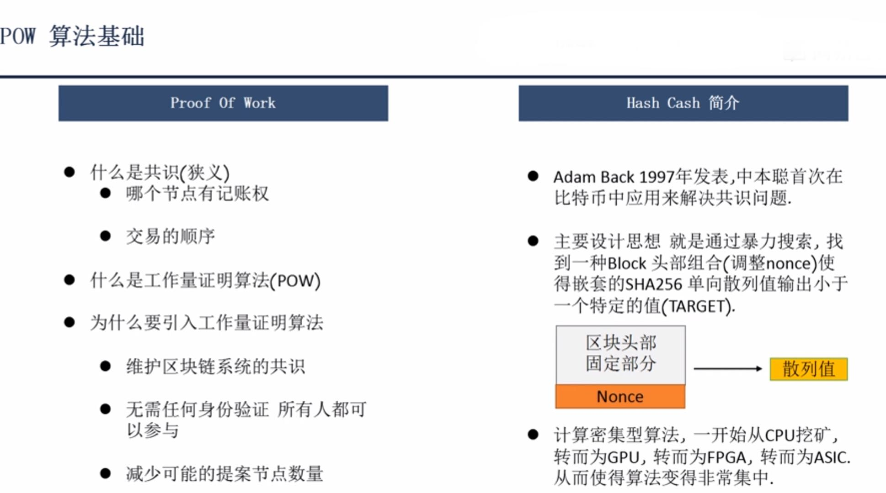

### Ethash算法

比特币中使用的挖矿算法为**Hash Cash**

* 挖矿时除了引入区块头之外还引入了**DAG**（随机数阵列）
* **Epoch** 世代，挖矿过程与Epoch有关，一个世代有30000个块（大约5天），同一个世代中使用相同的dag
* 图中有一处笔误，Cach Size = 64Bytes 的素数倍，因为Keccak 512输出长度是64B

##### 分为DAG随机数阵列生成和Hashimoto计算随机数生成结果两部分
1. DAG随机数阵列生成
> DAG 将数据分为三个层次，每个层次逐次增大
>> **SEED** 种子
>> **CACHE** 缓存层，每个数据大小64字节，第一个数据依赖种子，起始大小16M,每个世代增加8K
>> **数据层**，每个数据大小128字节，初始大小1G（目前大小为2G）【轻量级节点不会生成数据层，只有挖矿及full node节点生成】
2. Hashimoto 算法
> 流程如图，具体算法待补充

diff 以父块难度作为起点，加上线性元素（如是否包含叔块），再加上非线性元素（俗称难度炸弹）
