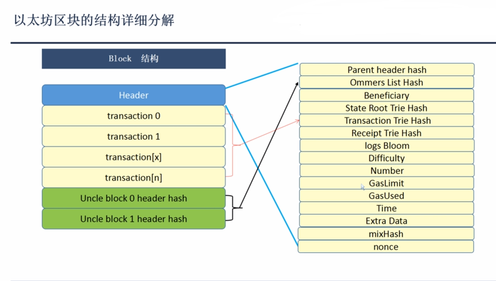
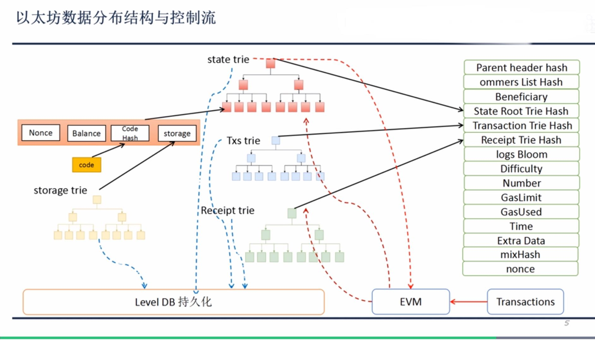
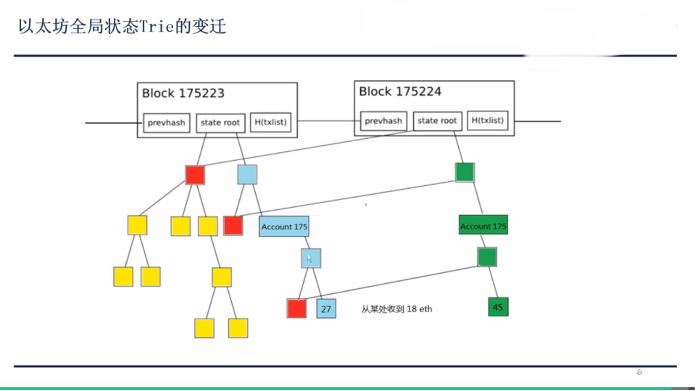

## 区块结构
### 区块结构图

#### 分为头部信息、交易信息、两个叔块的hash值三大部分
> ##### 头部信息详细说明
1. Parent header hash
父区块的哈希值
2. Ommers List hash
两个叔块hash值组成列表的hash值
3. Beneficiary
收益人，一般为矿工地址
4. State Root Trie hash
全局状态MPT树的hash值
5. Transaction Trie hash
效益MPT树的hash值
6. Receipt Trie hash
收据的MPT树hash值，一条交易对应一条收据,包含交易执行后衍生出的状态信息，包
含四个条目(交易后的状态、交易中累积gas的使用情况、交易发生后创建的日志集合、
交易执行的日志集合bloom过滤器)
7. Logs Bloom
整个区块的日志bloom过滤器，供用户查询某信息是否属于这个数据结构
8. Difficulty
当前挖矿难度值
9. Number
这个区块直系父节点个数，当前节点到创世节点的距离（ethereum中的链是一个
树状结构，中间有叔块）
10. Gaslimit
整个区块的gas上限，通过gaslimit限制区块大小
11. GasUsed
整个区块实际gas数量
12. Time
时间戳
13. Extra Data
14. mixHash
15. nonce
随机数

### 数据分布结构与控制流

1. State Trie  全局状态MPT树,**并非每次重新生成**，每次只更新需要更改的小部分（当叶子结点为合约帐户非EOA帐户时，包含4个部分）
>  Nonce 计数器，表示帐户已经执行的交易数量
>  Balance 帐户余额
>  Code hash 合约代码
>  storage 存储器，用来存储state变量，也是一棵MPT树
2. Txs trie 区块的交易MPT树
3. Receipt trie 区块收据的MPT树
***
当交易放入EVM中执行，先从state trie 中读取相关数据，再修改相关数据结构，存入level DB

***
### 全局状态树改变过程

图中175224节点修改了帐户余额，则去修改全局状态树中对应帐户的余额节点，保留蓝色节点（可追溯帐户之前余额情况），新增绿色节点，更改余额后
则对应的父节点也做相应改变
